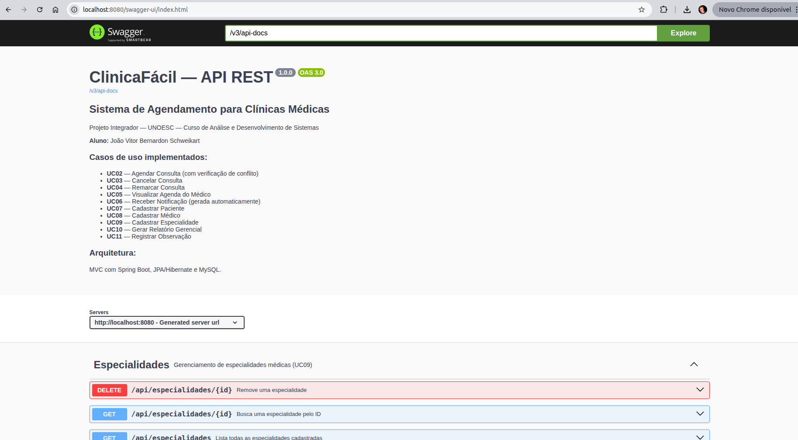

# ClinicaFácil — Sistema de Agendamento para Clínicas Médicas

> **Projeto Integrador**  
> Curso de Análise e Desenvolvimento de Sistemas — UNOESC  
> Aluno: João Vitor Bernardon Schweikart  
> Chapecó — SC, 2026

---

## Sobre o Projeto

O **ClinicaFácil** é uma API REST desenvolvida com **Java 17, Spring Boot 3.2 e MySQL**, que implementa um sistema de agendamento para clínicas médicas de pequeno e médio porte.

A aplicação transforma os modelos UML, regras de negócio e arquitetura definidos na primeira entrega em código funcional, seguindo os conceitos ensinados na disciplina, como configuração de ambiente, JPA/Hibernate, CRUD, testes e Swagger.

---

## Tecnologias Utilizadas

| Tecnologia | Versão | Finalidade |
|---|---|---|
| Java | 17 (LTS) | Linguagem principal |
| Spring Boot | 3.2.5 | Framework web e IoC |
| Spring Data JPA | 3.2.5 | ORM e repositórios |
| Hibernate | 6.x | Implementação JPA |
| MySQL | 8.x | Banco de dados relacional |
| Maven | 3.9+ | Gerenciamento de dependências |
| Springdoc OpenAPI | 2.5.0 | Documentação Swagger |
| Lombok | 1.18+ | Redução de boilerplate |
| JUnit 5 | 5.10 | Testes unitários |
| Mockito | 5.x | Mocks nos testes unitários |
| H2 | 2.x | Banco em memória para testes de integração |

---

## Arquitetura do Projeto

O projeto segue o padrão **MVC em camadas**, conforme orientado no estudo da disciplina:

---

## Pré-requisitos

- **Java 17+**
- **Maven 3.9+**
- **MySQL 8.x**

---

## Como Executar Localmente

### 1. Configurar o Banco de Dados MySQL

Abra o MySQL Workbench (ou terminal) e execute:

```sql
-- Cria o schema conforme orientado na disciplina
CREATE SCHEMA clinicafacil_db
    CHARACTER SET utf8mb4
    COLLATE utf8mb4_unicode_ci;
```

> O Hibernate criará as tabelas automaticamente na primeira execução (`ddl-auto=update`).

### 2. Configurar as Credenciais

Edite o arquivo `src/main/resources/application.properties` com suas credenciais MySQL:

```properties
spring.datasource.url=jdbc:mysql://localhost:3306/clinicafacil_db?useSSL=false&allowPublicKeyRetrieval=true&serverTimezone=America/Sao_Paulo
spring.datasource.username=root      # ← altere se necessário
spring.datasource.password=root      # ← altere se necessário
```

### 3. Compilar e Executar

**Opção A — Maven Wrapper (recomendado):**
```bash
cd clinicafacil
mvn spring-boot:run
```

**Opção B — JAR executável:**
```bash
mvn clean package -DskipTests
java -jar target/clinicafacil-1.0.0.jar
```

A aplicação estará disponível em: **http://localhost:8080**

---

## Documentação da API (Swagger)

Com a aplicação rodando, acesse:

```
http://localhost:8080/swagger-ui.html
```

O Swagger documenta todos os endpoints, parâmetros e modelos de dados. É possível testar as requisições diretamente pela interface, conforme o print abaixo:



### JSON da especificação OpenAPI:
```
http://localhost:8080/v3/api-docs
```

---

## 🔗 Endpoints da API

### Especialidades (`/api/especialidades`)
| Método | Endpoint | Descrição | UC |
|---|---|---|---|
| `GET` | `/api/especialidades` | Lista todas | UC09 |
| `GET` | `/api/especialidades/{id}` | Busca por ID | UC09 |
| `POST` | `/api/especialidades` | Cadastra nova | UC09 |
| `PUT` | `/api/especialidades/{id}` | Atualiza | UC09 |
| `DELETE` | `/api/especialidades/{id}` | Remove | UC09 |

### Pacientes (`/api/pacientes`)
| Método | Endpoint | Descrição | UC |
|---|---|---|---|
| `GET` | `/api/pacientes` | Lista todos | UC07 |
| `GET` | `/api/pacientes/{id}` | Busca por ID | UC07 |
| `GET` | `/api/pacientes/busca?nome=X` | Busca por nome | UC07 |
| `POST` | `/api/pacientes` | Cadastra | UC07 |
| `PUT` | `/api/pacientes/{id}` | Atualiza | UC07 |
| `DELETE` | `/api/pacientes/{id}` | Remove | UC07 |

### Médicos (`/api/medicos`)
| Método | Endpoint | Descrição | UC |
|---|---|---|---|
| `GET` | `/api/medicos` | Lista todos | UC08 |
| `GET` | `/api/medicos/{id}` | Busca por ID | UC08 |
| `GET` | `/api/medicos/especialidade/{id}` | Por especialidade | UC08 |
| `POST` | `/api/medicos` | Cadastra | UC08 |
| `PUT` | `/api/medicos/{id}` | Atualiza | UC08 |
| `DELETE` | `/api/medicos/{id}` | Remove | UC08 |
| `GET` | `/api/medicos/{id}/horarios` | Lista horários | UC05 |
| `POST` | `/api/medicos/horarios` | Adiciona horário | UC05 |
| `DELETE` | `/api/medicos/horarios/{id}` | Remove horário | UC05 |

### Consultas (`/api/consultas`)
| Método | Endpoint | Descrição | UC |
|---|---|---|---|
| `POST` | `/api/consultas` | Agenda consulta | UC02 |
| `GET` | `/api/consultas` | Lista todas | — |
| `GET` | `/api/consultas/{id}` | Busca por ID | — |
| `GET` | `/api/consultas/paciente/{id}` | Histórico do paciente | — |
| `GET` | `/api/consultas/medico/{id}/agenda?inicio=...&fim=...` | Agenda do médico | UC05 |
| `PATCH` | `/api/consultas/{id}/cancelar` | Cancela | UC03 |
| `PATCH` | `/api/consultas/{id}/remarcar` | Remarca | UC04 |
| `PATCH` | `/api/consultas/{id}/confirmar` | Confirma presença | — |
| `PATCH` | `/api/consultas/{id}/observacao` | Registra observação | UC11 |
| `GET` | `/api/consultas/relatorio` | Relatório gerencial | UC10 |

---

## Exemplos de Requisição (Postman / curl)

### Cadastrar Especialidade
```json
POST /api/especialidades
Content-Type: application/json

{
  "nome": "Cardiologia",
  "descricao": "Tratamento de doenças cardiovasculares"
}
```

### Cadastrar Médico
```json
POST /api/medicos
Content-Type: application/json

{
  "nome": "Dr. Carlos Souza",
  "email": "carlos@clinica.com",
  "senha": "Senha@123",
  "crm": "SC-12345",
  "especialidadeId": 1
}
```

### Adicionar Horário ao Médico
```json
POST /api/medicos/horarios
Content-Type: application/json

{
  "medicoId": 1,
  "diaSemana": "SEGUNDA",
  "horaInicio": "08:00",
  "horaFim": "12:00"
}
```

### Agendar Consulta (UC02 — fluxo principal do Diagrama de Sequência)
```json
POST /api/consultas
Content-Type: application/json

{
  "pacienteId": 1,
  "medicoId": 1,
  "dataHora": "2026-07-15T09:00:00"
}
```

### Remarcar Consulta (UC04)
```json
PATCH /api/consultas/1/remarcar
Content-Type: application/json

{
  "novaDataHora": "2026-07-20T14:00:00"
}
```

### Visualizar Agenda do Médico (UC05)
```
GET /api/consultas/medico/1/agenda?inicio=2026-07-01T00:00:00&fim=2026-07-31T23:59:59
```

---

## Testes

O projeto possui **dois tipos de testes**, conforme exigido na disciplina:

### Teste Unitário (Mockito)
Arquivo: `src/test/java/br/com/clinicafacil/service/EspecialidadeServiceTest.java`

- Testa o `EspecialidadeService` isoladamente, sem banco real
- Usa Mockito para simular o repository (`@Mock`)
- Cobre: criação com sucesso, nome duplicado, ID inexistente, listar e excluir

### Teste de Integração (@SpringBootTest)
Arquivo: `src/test/java/br/com/clinicafacil/controller/IntegracaoApiTest.java`

- Sobe o contexto completo do Spring com banco H2 em memória
- Testa os endpoints HTTP com MockMvc (simulação de requisições reais)
- Cobre: CRUD completo, validações, duplicatas, 404, 409, 400

### Executar os testes:
```bash
mvn test
```

### Executar apenas os testes unitários:
```bash
mvn test -Dtest=EspecialidadeServiceTest
```

### Executar apenas os testes de integração:
```bash
mvn test -Dtest=IntegracaoApiTest
```

---

## Banco de Dados — Modelo Relacional

```sql
-- Tabela principal (herança SINGLE_TABLE: Usuario + Paciente + Medico)
CREATE TABLE usuario (
    id          BIGINT AUTO_INCREMENT PRIMARY KEY,
    dtype       VARCHAR(30) NOT NULL,        -- 'PACIENTE' ou 'MEDICO'
    nome        VARCHAR(150) NOT NULL,
    email       VARCHAR(150) NOT NULL UNIQUE,
    senha_hash  VARCHAR(255) NOT NULL,
    perfil      VARCHAR(30) NOT NULL,
    criado_em   DATETIME NOT NULL,
    -- Campos de Paciente (nullable para Medico):
    cpf             VARCHAR(14) UNIQUE,
    data_nascimento DATE,
    telefone        VARCHAR(20),
    historico       TEXT,
    -- Campos de Medico (nullable para Paciente):
    crm              VARCHAR(20) UNIQUE,
    especialidade_id BIGINT,
    FOREIGN KEY (especialidade_id) REFERENCES especialidade(id)
);

CREATE TABLE especialidade (
    id        BIGINT AUTO_INCREMENT PRIMARY KEY,
    nome      VARCHAR(100) NOT NULL UNIQUE,
    descricao VARCHAR(255)
);

CREATE TABLE horario_disponivel (
    id         BIGINT AUTO_INCREMENT PRIMARY KEY,
    medico_id  BIGINT NOT NULL,
    dia_semana VARCHAR(10) NOT NULL,
    hora_inicio TIME NOT NULL,
    hora_fim    TIME NOT NULL,
    FOREIGN KEY (medico_id) REFERENCES usuario(id)
);

CREATE TABLE consulta (
    id          BIGINT AUTO_INCREMENT PRIMARY KEY,
    paciente_id BIGINT NOT NULL,
    medico_id   BIGINT NOT NULL,
    data_hora   DATETIME NOT NULL,
    status      VARCHAR(20) NOT NULL DEFAULT 'AGENDADA',
    observacao  TEXT,
    criado_em   DATETIME NOT NULL,
    FOREIGN KEY (paciente_id) REFERENCES usuario(id),
    FOREIGN KEY (medico_id)   REFERENCES usuario(id)
);

CREATE TABLE notificacao (
    id          BIGINT AUTO_INCREMENT PRIMARY KEY,
    consulta_id BIGINT NOT NULL,
    tipo        VARCHAR(20) NOT NULL,
    mensagem    TEXT NOT NULL,
    enviado_em  DATETIME,
    FOREIGN KEY (consulta_id) REFERENCES consulta(id)
);
```

> **Nota:** As tabelas são criadas automaticamente pelo Hibernate na primeira execução (`spring.jpa.hibernate.ddl-auto=update`).
